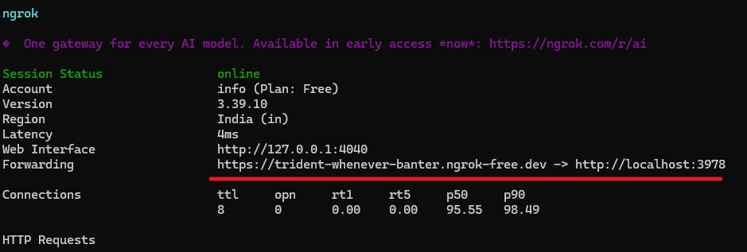
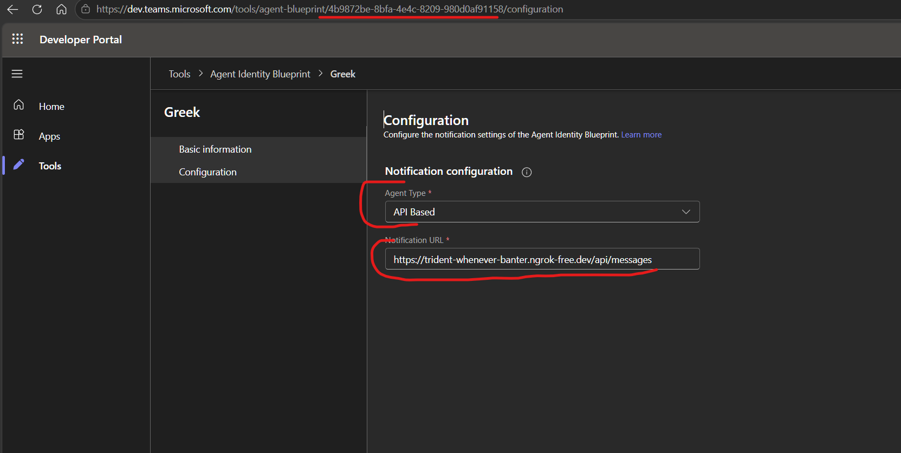

# Hello World Sample

This sample demonstrates a basic C# "Hello World" application that serves as an introductory guide for developers getting started with the Agent Identity framework. It illustrates fundamental concepts including project setup, basic syntax, and executing a simple console application. The example walks through creating a minimal console program that outputs a greeting message, providing a foundation for understanding how to structure C# projects within the Agent Identity ecosystem.

## Prerequisites

Complete the [Agentic User Setup](../Agentic-User-Setup.md).

## Setup `appsettings.json`

Goto `appsettings.json`, leave the other values as is and configure the following:

```
"AzureAd": {
    "ClientId": "<this is the agent blueprint appId configured in setting up agent blueprint>",
    "TenantId": "<this is the tenant id where this agent blueprint is configured>",
    "ClientCredentials": [
      {
        "SourceType": "ClientSecret",
        "ClientSecret": "<client secret for agent blueprint configured in the step 1 of the setup>"
      }
    ]
}
```

## Running the sample locally

### Install dotnet 10+

Make sure .NET 10+ sdk is installed, you can check the installed sdks by running the following command:
 
```powershell
dotnet --list-sdks
```

In case dotnet is not installed, install the .NET 10 sdk here: [dotnet10](https://dotnet.microsoft.com/en-us/download)

### Run the server locally

```powershell
dotnet build; dotnet run --no-build;
```

This will run the server locally on `http://localhost:3978`

### Expose to internet

For testing, you'll need to expose the server to the internet so that Microsoft Teams can communicate with it. You can use any tunneling software, such as ngrok, for this purpose. This setup is only for testing and should not be used in production.
- Install [ngrok](https://ngrok.com/) and create a free account 
- Add your ngrok authentication token on your local machine. (available after creating your account), `ngrok config add-authtoken <token>`
- run `ngrok http 3978` it will give an https endpoint (example: `https://domain.ngrok-free.dev`), this means that your local server is now accessible from the internet at this endpoint.




### Configure ngrok endpoint

In the Microsoft 365 Developer Portal, configure the endpoint.

Open the following URL in your browser: `https://dev.teams.microsoft.com/tools/agent-blueprint/<id>`

`<id>` is the agent blueprint appid created while setting up the blueprint

In developer Portal > goto Configuration > Notification Configuration
- Set `Agent Type` as `API Based`
- Set `Notification Url` as the ngrok endpoint `https://domain.ngrok-free.dev/api/messages`




## Testing the sample

Goto Teams, search for the agentic user nd start a chat with it. The agent will echo back the message you send to it. You can also test the agent using the Teams Web Client or the Teams Desktop Client.