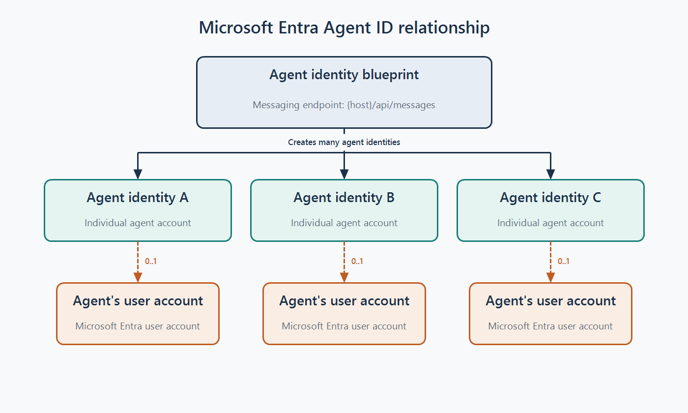

# Agent's User Account Setup

Follow these steps to create an agent identity blueprint and an agent identity, provision the agent's Microsoft Entra user account, and make that account available in Microsoft Teams.

## What is an agent's user account?
An agent's user account is an created when an agent needs a Microsoft Entra user account. With the appropriate licenses, it can have Microsoft 365 resources such as a mailbox and OneDrive storage, appear in organizational metadata, and be reached through Microsoft Teams and other Microsoft 365 experiences. For more information, see [Agent's user account](https://learn.microsoft.com/en-us/microsoft-agent-365/developer/identity#agents-user-account) and [Agent identities](https://learn.microsoft.com/en-us/entra/agent-id/agent-identities).

The account belongs to an agent identity, which is created from an agent identity blueprint. One blueprint can create many agent identities. Each agent identity can have zero or one agent's user account, and each account belongs to exactly one agent identity.

For Teams integration in these samples, configure the messaging endpoint associated with the agent identity blueprint. Teams messages and other events are sent to this endpoint.



## Prerequisites

- Access to the [Microsoft Entra admin center](https://entra.microsoft.com/)
- Access to the [Microsoft Teams Developer Portal](https://dev.teams.microsoft.com/)
- Access to [Microsoft Graph Explorer](https://developer.microsoft.com/graph/graph-explorer)
- Permissions to create agent identities, users, and OAuth permission grants
- An available Microsoft 365 E3 (or Teams) license


## 1. Create an Agent Identity Blueprint

1. Open [Agent Blueprints in the Microsoft Entra admin center](https://entra.microsoft.com/#view/Microsoft_AAD_RegisteredApps/AllAgents.MenuView/~/overview).
2. Create an agent identity blueprint.
3. Save the following values for later:
   - Agent identity blueprint `appId`
   - Agent identity blueprint `principalObjectId`
4. Create a client secret for authentication and store it securely.
   - In the Microsoft Entra admin center, open the same agent identity blueprint and go to `Credentials` > `Client secrets` > `New client secret`. Save the `value` securely; it is used to configure the agent service in the next step.
   - Use `Client secrets` under `Credentials`, **not** `Federated credentials`, for these samples.
5. Open the blueprint in the Teams Developer Portal, replacing `{appId}` with the saved agent application ID:

   ```text
   https://dev.teams.microsoft.com/tools/agent-blueprint/{appId}
   ```
   Set the agent endpoint URL to the service where the agent is hosted: `{host}/api/messages`. Refer to the sample's README for details. You can use ngrok to expose your local service to the internet and configure this endpoint later if the sample is not running yet.
6. Record your `tenantId`. You can find it in the [Microsoft Entra admin center tenant overview](https://entra.microsoft.com/#view/Microsoft_AAD_IAM/TenantOverview.ReactView).


From this step, you should have the following values saved for later use:
- Agent identity blueprint `appId`
- Agent identity blueprint `principalObjectId`
- Agent identity blueprint `clientSecret`
- Tenant ID `tenantId`


## 2. Assign the SMBA Permission to the Agent Identity Blueprint

The caller needs the `DelegatedPermissionGrant.ReadWrite.All` permission.

Before submitting the request in Microsoft Graph Explorer, open **Modify permissions**, add `DelegatedPermissionGrant.ReadWrite.All`, and select **Consent**. If prompted, accept the permissions on behalf of your organization. You must be signed in to the tenant where you created the agent identity blueprint and have a role that can grant this permission.

In Microsoft Graph Explorer, submit the following request. Replace `<principalObjectId>` with the value saved in step 1; leave the other values unchanged.

```http
POST https://graph.microsoft.com/v1.0/oauth2PermissionGrants
Content-Type: application/json
```

```json
{
  "clientId": "<principalObjectId>",
  "consentType": "AllPrincipals",
  "principalId": null,
  "resourceId": "d1201fa8-a3fc-402b-9147-c4714c994930",
  "scope": "AgentData.ReadWrite"
}
```

You should receive a `201 Created` response.

## 3. Create an Agent Identity

1. Open [Agent Identities in the Microsoft Entra admin center](https://entra.microsoft.com/#view/Microsoft_AAD_RegisteredApps/AllAgents.MenuView/~/allAgentIds).
2. Create an agent identity.
3. Select the agent identity blueprint from step 1.

Save the object ID returned for the new agent identity. This value is referred to as `<agentIdentityObjectId>` in the next step.

## 4. Assign the SMBA Permission to the Agent Identity

The caller needs the `DelegatedPermissionGrant.ReadWrite.All` permission.

In Microsoft Graph Explorer, submit the following request. Replace `<agentIdentityObjectId>` with the value saved in step 3; leave the other values unchanged.

```http
POST https://graph.microsoft.com/v1.0/oauth2PermissionGrants
Content-Type: application/json
```

```json
{
  "clientId": "<agentIdentityObjectId>",
  "consentType": "AllPrincipals",
  "principalId": null,
  "resourceId": "d1201fa8-a3fc-402b-9147-c4714c994930",
  "scope": "AgentData.ReadWrite"
}
```

You should receive a `201 Created` response.

## 5. Create the Agent's User Account

The caller needs the `AgentIdUser.ReadWrite.IdentityParentedBy` permission.

Before submitting the request in Microsoft Graph Explorer, open **Modify permissions**, add `AgentIdUser.ReadWrite.IdentityParentedBy`, and select **Consent**. If prompted, accept the permissions on behalf of your organization.

In Microsoft Graph Explorer, submit the following request to create the Microsoft Graph `agentUser` resource. Replace the example values as needed and set `<agentIdentityObjectId>` to the agent identity object ID saved in step 3.

```http
POST https://graph.microsoft.com/beta/users/microsoft.graph.agentUser
Content-Type: application/json
```

```json
{
  "accountEnabled": true,
  "displayName": "Phoenix",
  "mailNickname": "Phoenix",
  "userPrincipalName": "Phoenix@contoso.onmicrosoft.com",
  "identityParentId": "<agentIdentityObjectId>",
  "usageLocation": "US"
}
```

Save the `id` returned for the agent's user account. This value is referred to as `<agentUserId>` in the next step.


## 6. Assign a Microsoft 365 E3 License

The caller needs the `LicenseAssignment.ReadWrite.All` permission.

Before submitting the request in Microsoft Graph Explorer, open **Modify permissions**, add `LicenseAssignment.ReadWrite.All`, and select **Consent**. If prompted, accept the permissions on behalf of your organization.

Replace `{agentUserId}` with the agent user ID saved in step 5. The following payload uses the Microsoft 365 E3 SKU and should otherwise remain unchanged.

```http
POST https://graph.microsoft.com/v1.0/users/{agentUserId}/assignLicense
Content-Type: application/json
```

```json
{
  "addLicenses": [
    {
      "skuId": "6fd2c87f-b296-42f0-b197-1e91e994b900",
      "disabledPlans": []
    }
  ],
  "removeLicenses": []
}
```

## 7. Verify the Agent's User Account in Teams

1. Open Microsoft Teams and locate the newly created agent's user account. The first time, you might need to enter the full email address, for example, `phoenix@contoso.onmicrosoft.com`.
2. Send a test message to the account to verify that the setup works.

Note: For the message to reach your server and for the server to respond, configure the server endpoint for this agent identity blueprint in the Teams Developer Portal.

Complete this step after a sample is running locally and exposed to the internet through ngrok or another tunneling service. Follow the sample's README to set up the sample and configure the endpoint in the Teams Developer Portal.
