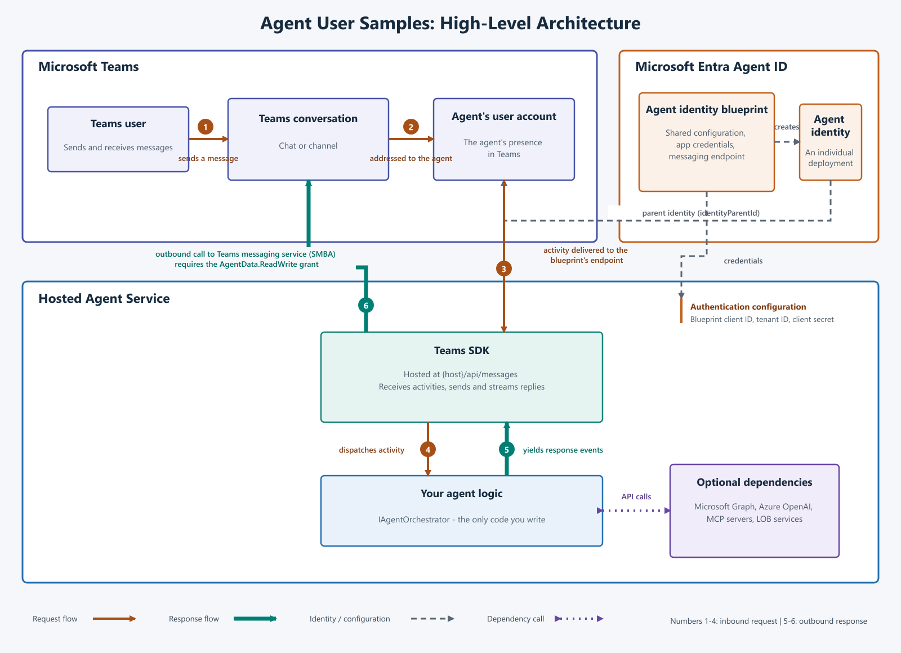

# Agentic user samples

Samples for showcasing agentic users in Microsoft Teams.

## Setup guide

There are two parts to setting up this sample
- Create an agentic user [Agentic User Setup](./Agentic-User-Setup.md)
- Set up any of the demo (start with [Hello World](./1-csharp-hello-world/Readme.md) demo)

## Samples

- [1 - C# Hello world](./1-csharp-hello-world/Readme.md)
- [2 - C# Graph Api](./2-csharp-graph-api/Readme.md)
- [3 - C# Azure OpenAI](./3-csharp-azure-openai/Readme.md)
- [4 - C# Teams SDK capabilities](./4-csharp-teams-sdk-capabilities/README.md) — streaming AI, scoped memory isolation, Adaptive Cards, reactions, GitHub Actions analysis, and proactive notifications

## Demo video

## High level architecture

