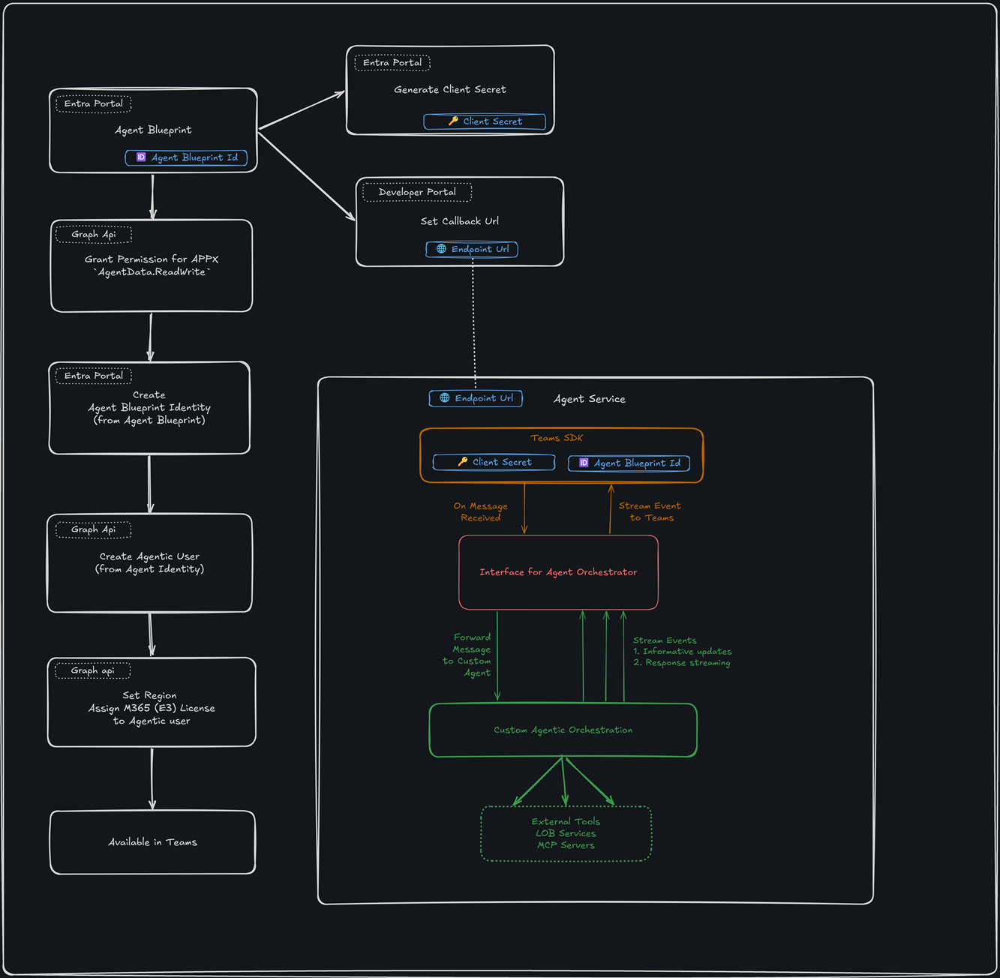

# Agentic user samples for BNY

Samples for showcasing agentic users for BNY's use case.

## Demo video


## High level architecture



## Setup guide

There are 2 parts of the setup
- Create an agentic user
- Set up any of the demo (start with Hello World)


## Running locally

1. Run the app:

   chsarp
   ```powershell
   dotnet build; dotnet run --no-build;
   ```

2. In another terminal, launch Microsoft 365 Agents Playground:

   ```powershell
   npx @microsoft/m365agentsplayground -e http://localhost:3978/api/messages -c emulator
   ```

The app listens on `http://localhost:3978` and exposes `POST /api/messages`.
